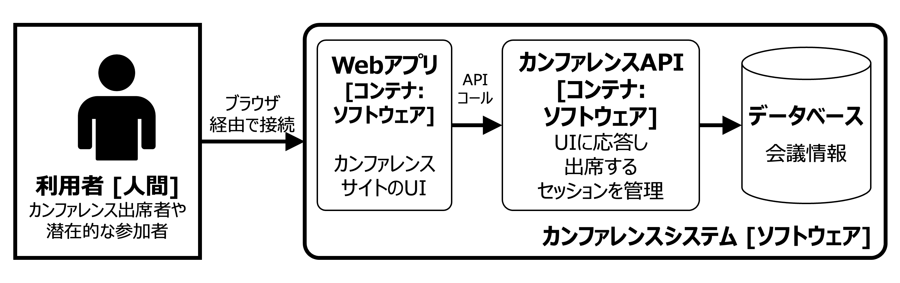

# イントロダクション
ここではAPIの基礎とAPIがアーキテクチャ探訪につながるものであることを理解します。まずAPIの簡単な定義とインプロセスAPIとアウトオブプロセスAPIについて説明します。そしてAPIの重要性を示すために本書を通じてアーキテクチャを進化させていくケーススタディとしてカンファレンスシステムを紹介します。アウトオブプロセスAPIは単純な3層のアーキテクチャを超えた考え方を示します。これを説明するためにトラフィックパターンとその重要性を紹介します。段階的にケーススタディの概要を説明していきますので、興味のあるエリアがあればすぐに読み進めることができるようになっています。

また、APIとそれに関連するエコシステムを表すため、[C4モデル図](https://www.infoq.com/jp/articles/C4-architecture-model/)を使ってケーススタディを紹介し、アプローチの背後にある仕様と論理を検討します。さらに、アーキテクチャ決定記録（ADR）の使用とソフトウェアライフサイクル全体にわたる決定を明確に定義することの価値について学びます。最後に「場合による」判断が必要な場合に意思決定を行うのに役立つアプローチであるADRガイドラインについて説明します。

## アーキテクチャ探訪
長旅をしたことのある人なら何度も「まだ着かないの?」と思ったことがあるでしょう。最初の数回はGPSや経路探索を見て、道中で遅延がないことを祈りながら、どのくらいで到着するかを調べます。同じくAPIベースのアーキテクチャを構築するための旅は開発者やアーキテクトにとって複雑なものになり得ます。アーキテクチャ用のGPSがあったとしても目的地はどこだろうと悩むことでしょう。

アーキテクチャは目的地のない旅であり、技術やアーキテクチャのアプローチがどのように変化していくかを予測することはできません。例えば、サービスメッシュ技術がこれほど広く使われるようになるとは予想できなかったかもしれませんが、その機能を知れば既存のアーキテクチャを進化させることを考えるきっかけになるかもしれません。アーキテクチャの変化に影響を与えるのは技術だけではありません。新しいビジネス要件や制約もアーキテクチャの方向性を変える原動力となります。

このように積み上げ式に価値を提供することと新たに登場した技術を組み合わせることで、進化型アーキテクチャのコンセプトが生まれます。進化型アーキテクチャとは、アーキテクチャを積み上げ式で進化させるアプローチであり、スピード感をもって変化し、変化による悪影響のリスクを低減させることに重点を置きます。その過程では、APIアーキテクチャにアプローチする際の以下のアドバイスを心に留めておいてください。

>アーキテクトは戦略的な将来計画を立てたいものですが、ソフトウェア開発のエコシステムが常に変化しているため、それは困難なことです。変化を避けることはできないので、変化を利用する必要があります。
>
>[進化的アーキテクチャ](https://www.oreilly.co.jp/books/9784873118567/)より

多くのプロジェクトにおいて、APIそのものが進化するものであり、より多くのシステムやサービスが統合されるにつれて変化を求められます。ほとんどの開発者は、利用者の視点からより広範なAPIの再利用を考慮することなく、単一の機能に焦点を当てたサービスを構築してきました。

APIファースト設計は、開発者やアーキテクトがサービスの機能を考慮し、利用者中心にAPIをデザインするアプローチをとります。API利用者はモバイルアプリや他のサービス、あるいは外部の顧客である可能性もあります。[第1章](./1.md)では、APIファーストのアプローチをサポートする設計テクニックを紹介し、変化に強く幅広い利用者層に価値を提供するAPIを構築する方法を見つけます。

とてもよいことに、API駆動型アーキテクチャの旅はどの時点からでも始められます。もしあなたが既存の技術の棚卸担当なら、私たちはあなたのプラットフォームでAPIの利用を促進するためにアーキテクチャを進化させるテクニックをお見せします。一方、もしあなたが幸運にも何もない真っ白なキャンバスをお持ちなら、長年の経験に基づいたAPIアーキテクチャを採用する利点を共有し、意思決定における重要な要因も強調して紹介します。 

## APIの簡単な紹介
ソフトウェアアーキテクチャの分野では、定義するのが非常に難しい用語がいくつかあります。アプリケーションプログラミングインターフェイスの略であるAPIという用語もこの種類のもので、その概念は80年も前にあらわれたものです。長い間使われてきた用語は、結局使い古され、異なる問題領域で複数の意味を持つようになります。我々はAPIを以下のように考えています。

- APIは基礎となる実装を抽象化したものです。
- APIは型を導入した仕様で表現されます。
- 開発者は仕様を理解し、ツールを使って複数の言語でコードを生成し、APIコンシューマ（APIを利用するソフトウェア）を実装します。
- APIは情報交換を効果的にモデル化するためにセマンティクスや動作を定義します。
- 効果的なAPI設計は顧客や第三者への拡張を可能にし、ビジネス統合を実現します。

大まかに言って、APIはAPIの呼び出しがプロセス内かプロセス外かによって、2つの一般的なカテゴリに分けることができます。ここでいうプロセスとは、オペレーティング・システム（OS）のプロセスのことです。たとえば、あるクラスから別のクラスへのJavaメソッドの呼び出しは、呼び出しが行われたのと同じプロセスで処理されるため、プロセス内(インプロセス)APIの呼び出しとなります。HTTPライブラリを使用して外部のREST的なAPIを呼び出す.NETアプリケーションは、呼び出し元のプロセス以外の追加の外部プロセスによって処理されるため、プロセス外(アウトオブプロセス)API呼び出しとなります。このアウトオブプロセスAPI呼び出しでは、ローカルネットワーク、仮想プライベートクラウド（VPC）ネットワーク、またはインターネットなどのネットワーク上でデータの行き来を伴う可能性があります。我々は後者のアウトオブプロセスAPIのAPIスタイルに焦点を当てます。しかし、アーキテクトはしばしばインプロセスAPIをアウトオブプロセスAPIに移行する必要性に遭遇します。これらを示すために本書を通じて発展するケーススタディを作成します。

## ケーススタディ: カンファレンスシステム
本書ではカンファレンスシステムをモデル化することをケーススタディとして選びました。というのも、このドメイン(業務領域)は容易に理解することができますが、進化的なアーキテクチャをモデル化するには十分な複雑さを備えているからです。下図では、カンファレンスシステムをトップレベルで可視化し、アーキテクチャのコンテキストを議論の土台に置きます。このシステムでは、外部の利用者がアカウントを作成し、カンファレンスで開催されるセッションを確認し、出席の予約をすることができます。

<b>図1. C4コンテキストダイアグラム</b>

 
 

このカンファレンスシステムのボックスを拡大してみましょう。

<b>図2. C4コンテナダイアグラム</b>

 
 

カンファレンスシステムを拡大するとその主要な技術的構成要素についてより詳細な情報を得ることができます。利用者はWebアプリと対話し、WebアプリはカンファレンスAPIを呼び出します。カンファレンスAPIはSQLを使用してバックエンドのデータベースに問い合わせを行います。

APIの観点からもっとも興味深い機能がカンファレンスAPIのコンテナ内にあります。下図では、この特定のコンテナにズームインし、構造と相互作用を見ることができます。

<b>図3. C4コンポーネントダイアグラム</b>

 
 

現在のシステムには、4つの主要コンポーネントとデータベースがあります。APIコントローラはUIから入ってくるすべてのトラフィックに対面し、システム内のどこにリクエストをルーティングするかを決定します。また、このコンポーネントはネットワークレベルの表現からオブジェクトやコード上の表現への変換を担当します。APIコントローラ・コンポーネントは、プロセス内ルーティングの観点で接合ポイントとして機能し、いわゆる[フロントコントローラパターン](https://www.samuraiz.co.jp/adobeproduct/jrun/docs/jr4/docs/html/Programmers_Guide/designpatterns4.html)の形式をとることが注目すべきところです。APIリクエストと処理にとってこれは重要なパターンです。すべてのリクエストはコントローラを通過し、コントローラはリクエストがどこに向けられるかを決定します。[第3章](./3.md)ではコントローラをプロセスの外に持ち出す可能性について見ていきます。

出席者、予約、セッションの各コンポーネントは、リクエストをクエリに変換し、プロセス外でデータベースに対してSQLを実行することに関与しています。既存のアーキテクチャでは、データベースは重要なコンポーネントであり、例えば予約とセッション間の制約など、コンポーネント間のリレーションが強制される可能性があります。

さて、適切なレベルまでドリルダウンしたところで、この時点でケーススタディにおけるAPIインタラクションの種類を再確認しておきましょう。

### カンファレンスシステムのケーススタディにおけるAPIの種類
上図におけるWebアプリからAPIコントローラへの矢印はアウトオブプロセスAPI呼び出しであり、APIコントローラから出席者コンポーネントへの矢印はインプロセスAPI呼び出しの例になります。カンファレンスAPI境界内のすべての相互作用はインプロセスAPI呼び出しの例になります。インプロセスAPI呼び出しは、カンファレンスAPIを実装するために使用されるプログラミング言語によって明確に定義され、制限されます。この呼び出しはコンパイル時安全であり、この交換メカニズムはコードを書く時に条件が強制的に決定されます。

### カンファレンスシステム変更の理由
現在のアーキテクチャのもと長年にわたってカンファレンスシステムは機能してきましたが、カンファレンスオーナーから下記の3つの改善要求があったため、アーキテクチャの変更を進めています。

- カンファレンス主催者は、モバイルアプリケーションを作りたいと考えています。
- カンファレンス主催者は、年に1回ではなく、数十回のカンファレンスを開催し、システムをグローバルに展開することを計画しています。この拡張を容易にするために講演者とその講演申込を管理する外部のCall for Papers(CFP)システムと統合したいとのことです。
- カンファレンス主催者は、プライベートなデータセンターを廃止し、代わりにグローバルに展開するクラウドプラットフォームでカンファレンスシステムを稼働させたいと考えています。

目標は、既存の本番システムに影響を与えず、すべてを一度に書き換えるのではなく、新しい要件に対応できるカンファレンスシステムに移行することです。

### 階層型アーキテクチャからAPIのモデリングへ
ケーススタディの出発点は、UI、サーバーサイドの処理層、データストアからなる典型的な3層アーキテクチャです。進化型アーキテクチャの議論を始めるには、APIリクエストがコンポーネントによって処理される方法について考えるためのモデルが必要です。パブリッククラウド、データセンターの仮想マシン、ハイブリッドなアプローチのいずれにも対応できるモデルや抽象化が必要になります。

トラフィックを抽象化することで、APIコンシューマとAPIサービス（APIプロデューサと呼ばれることもある）の間のアウトオブプロセス・インタラクションを考えることができるようになります。サービス指向アーキテクチャ(SOA)やマイクロサービス・ベースのアーキテクチャのようなアーキテクチャ・アプローチでは、APIインタラクションをモデル化することの重要性は極めて重要です。APIトラフィックとコンポネント間のコミュニケーションスタイルについて学ぶことは、たくさんの疎結合化による利点を享受するか、メンテナンスの悪夢を作り出すかの違いに影響してきます。

データセンターのエンジニアは、トラフィックパターンを使ってデータセンター内や低レベルのアプリケーション間で行われるネットワーク交換を記述します。しかし、APIレベルでは、アプリケーションのグループ間のフローを記述するために、トラフィックパターンを使用します。この本の目的上、アプリケーションとAPIレベルのトラフィックパターンについて説明します。

### ケーススタディ: 進化ステップ
トラフィックパターンの種類を検討し始めるには、ケーススタディのアーキテクチャを少し進化させることが有効です。

<b>図4. C4コンテキストダイアグラム進化版</b>

 
 
上図では、従来のカンファレンス・システム内の出席者モジュールを、出席者コンポーネントとして独立したサービスにリファクタリングする手順が実行されています。カンファレンスシステムには「利用者とカンファレンス・システム間のインタラクション」と「カンファレンスシステムと出席者システム間のインタラクション」の2つのトラフィックフローがあります。

#### 垂直型トラフィック
上図では、利用者とカンファレンス・システムの間の相互作用は垂直型トラフィックと呼ばれ、入力方向のフローを表しています。利用者はUIを使用し、インターネット経由にカンファレンス・システムにリクエストを送信します。これは、UIからアクセスされる一般に公開されたネットワーク上のポイントを表しています。つまり、垂直型トラフィックを処理するコンポーネントは、クライアントのアイデンティティのチェックを行い、トラフィックをシステムに進める前に適切なチャレンジを含めなければならない、ということになります。[第7章](./7.md)では、垂直型APIトラフィックのセキュリティについて詳しく説明します。

#### 水平型トラフィック
カンファレンス・システムと出席者サービス間の新しい相互作用は、私たちのシステムに水平型トラフィックフローを導入します。水平方向のトラフィックは、アプリケーションのグループ内のサービス間コミュニケーションと考えることができます。ほとんどの水平型トラフィックでは、発信元が自分たちの大きなインフラ内にある場合、ある程度信頼することができます。トラフィックのソースを信頼することができるといっても、水平型トラフィックの安全が確保されているかどうかは逐次検討する必要があります。 

### APIインフラとトラフィックパターン
APIベースのアーキテクチャには、トラフィックを制御するための鍵となる2つの重要なインフラ上のコンポーネントがあります。トラフィックを制御し調整することは、しばしばトラフィック管理と表現され、一般に垂直型トラフィックはAPIゲートウェイによって制御されます。これらは[第3章](./3.md)で扱います。一方、水平型トラフィックは、多くの場合、Kubernetesやサービスメッシュのようなインフラコンポーネントによって処理されます。これらは[第4章](./4.md)で扱います。Kubernetesやサービスメッシュのようなインフラ・コンポーネントでは、ネットワーク抽象化を使用してサービスにルーティングし、サービスが管理された環境内で実行されることを要求します。一部のシステムでは、水平型トラフィックはアプリケーション自体によって管理され、他のシステムの位置を特定するためのサービス発見技術が実装されています。

### カンファレンス・ケーススタディのロードマップ
本書の各章を通じて、ケーススタディに対する技術の変化や適用の様子を見ることができます。

- [第1章](./1.md)では、出席者APIの設計と仕様について検討します。また、出席者APIのパフォーマンスに関するバージョン管理およびモデリング・エクスチェンジの重要性を紹介します。
- [第2章](./2.md)では、出席者サービスの動作を検証するために、コントラクトテストとコンポーネントテストについて学びます。また、テストコンテナが統合テストにどのように役立つかについても説明します。
- [第3章](./3.md)では、APIゲートウェイを使用して出席者サービスをコンシューマーに公開することについて見ていきます。また、Kubernetes上でAPIゲートウェイを使用してカンファレンス・システムを進化させる方法を紹介します。 
- [第4章](./4.md)では、レガシーなカンファレンス・システムから、サービスメッシュを使用してセッション機能をリファクタリングします。また、サービスメッシュがどのようにルーティング、可観測性、セキュリティに役立つかについても学びます。
- [第5章](./5.md)では、機能フラグについて説明し、これがカンファレンス・システムを進化させ、展開とリリースを連動させることを回避するのに役立つことを説明します。またカンファレンス・システムのリリースをモデル化するアプローチを模索し、出席者サービスに[アルゴロールアウト](https://argoproj.github.io/rollouts)を使用するデモを行います。
- [第6章](./6.md)では、出席者サービスに脅威モデリングを適用し、OWASPの懸念を軽減する方法について説明します。 
- [第7章](./7.md)では、認証と認可についてそしてこれがどのように出席者サービスに実装されるかを見ていきます。
- [第8章](./8.md)では、出席者サービスのドメインバインディングの確立と、さまざまなサービスパターンがどのように役立つかについて見ていきます。
- [第9章](./9.md)では、クラウドの導入について、出席者サービスをクラウドに移行し、リプラットフォームを検討する方法について見ていきます。

ケーススタディと計画されたロードマップは、アーキテクチャの変更を可視化し、アーキテクチャ上の決定を記録することを要求しています。これらは、ソフトウェアプロジェクトにおける変更を説明し、計画するのに役立つ重要な成果物です。私たちは、C4ダイアグラムとアーキテクチャ決定記録（ADR）が、変更を記録する明確な方法であると信じています。

## C4ダイアグラムの使用
事例紹介の一環として、[C4モデル](https://www.infoq.com/jp/articles/C4-architecture-model/)から3種類のC4ダイアグラムを公開しました。C4は、多様なステークホルダーに対して、アーキテクチャ、コンテキスト、インタラクションを伝えるための最適なドキュメント・スタンダードであると私たちは考えています。UMLはどうなんだろう、と思われるかもしれません。UML（Unified Modeling Language）は、ソフトウェアアーキテクチャを伝えるための広範な方言を提供します。大きな課題は、UMLが提供する内容の大半がアーキテクトや開発者の記憶に残らないことであり、人々はすぐにボックス／サークル／ダイヤモンドといった図に戻ってしまいます。技術的な内容の議論に入る前に、図の構造を理解することが本当に難しくなっています。多くの図は、誰かが誤って水性マーカーではなく油性マーカーを使った場合にのみ、プロジェクトの履歴に残ります。C4モデルは、プロジェクト・アーキテクチャを様々な詳細レベルで示すガイドとして機能する、簡略化されたダイアグラムのセットを提供します。

### C4コンテクスト図
図1はC4モデルからC4コンテキストダイアグラムを用いて表現しています。このダイアグラムは技術者と非技術者の両方のためにコンテキストを設定することを意図しています。多くのアーキテクチャーの会話ではすぐに低レベルの詳細が語られ、高レベルの相互作用のコンテキストが設定されないことがあります。システムコンテキストダイアグラムの理解に誤解が生じてしまうことを想像してみてください。アプローチをまとめることで誤解を修正するために何ヶ月もかかるのを回避できるかもしれません。

### C4コンテナダイアグラム
図1はカンファレンス・システムの全体像を示していますが、コンテナダイアグラムはアーキテクチャの主要な参加者の技術的な分担を説明するのに役立ちます。C4におけるコンテナとは、「システム全体が動作するために必要なもの」（例：カンファレンスデータベース）と定義されます。コンテナダイアグラムは技術的なものであり、上位のシステムコンテキストダイアグラムの上に構築されます。図2はコンテナ図で、利用者がカンファレンスシステムとやりとりする様子を詳細に記録しています。

> 図2のカンファレンスAPIコンテナは単にソフトウェアと表記されていますが、通常、C4コンテナは、コンテナの種類について詳細が記載されます（例えば、Java Spring Applicationなど）。しかし、本書では、具体的なソリューションを表現しない場合は、具体的な技術の特定は行いません。APIや最近のアプリケーションの利点はソリューション空間においてかなりの柔軟性を持っているものです。

### C4コンポーネントダイアグラム
図3のC4コンポーネントダイアグラムは、各コンテナ内の役割と責任、および内部の相互作用を定義するのに役立ちます。このダイアグラムは、コンテナの詳細を表すのに有用であり、また、コードベースへの非常に有用なマップを提供します。新しいプロジェクトで初めて作業を始めるときのことを考えてみてください。自己記録されたコードベースを閲覧するのも一つの方法ですが、すべてをつなぎ合わせるのは難しいかもしれません。コンポーネント図は、あなたがソフトウェアを構築するために使用している言語/スタックの詳細を明らかにします。技術にとらわれないために、私たちはパッケージ／モジュールという言葉を使いました。

## アーキテクチャ決定記録の使用
開発者、建築家そして人間として、「彼らは何を考えていたのか？」という疑問を抱く立場になることは誰にでもあるはずです。イギリスのリーズとマンチェスターを結ぶM62を運転したことがある人は、高速道路の構造に困惑したことがあるかもしれません。3車線の高速道路を坂道で登っていくと、交通規制から外れていき、やがて約15エーカーの農地に囲まれたスコット・ホール・ファームが姿を現します。地元の話によるとこの土地の所有者は頑固で土地を動かすことも譲ることも拒んだので、高速道路のエンジニアはその土地の周りに道路を建設したとのこと。50年後あるドキュメンタリー番組で、この土地の地下に地層があるため高速道路がそのように建設されたことが本当の理由であることが明らかにされました。人々が何かを他と違った方法で行った理由を想像するとき、噂、ユーモア、そして批判が発生することがあります。

ソフトウェア・アーキテクチャでは、構築しなければならない多くの制約があるため、決定を記録し、透明性を確保することが重要です。ADRはソフトウェアアーキテクチャにおける決定を明確にするのに役立ちます。

>プロジェクト期間中に追跡するのが最も困難なことの1つは、特定の決定の背後にある動機が何かということです。プロジェクトに新しく参加した人は、過去のある決定に当惑し、困惑し、喜び、激怒したりすることがあります。
>
> マイケル・ナイガード（ADRコンセプトの考案者）

ADRには、「状態」「コンテキスト」「決定」「結果」という4つの重要な要素があります。ADRは、提案された状態で作成され、議論に基づいて、通常、受諾されるか拒否されるかのどちらかになります。また、その決定が後に新たなADRに取って代わられることもあり得ます。コンテキストは、場面を設定し、決定が行われる問題や境界を説明するのに役立ちます。ADRに先立ってブログ記事を作成し、ADRからリンクすることは、コミュニティがあなたの仕事をフォローするのに役立ちますが、コンテキストはブログ記事または詳細な説明を意図したものではありません。決定は、あなたが何をどのように行う予定なのかを明確に示しています。アーキテクチャにおけるすべての決定は、結果またはトレードオフを伴い、これらは時として間違うととてつもなく大きな代償を払うことになります。

ADRをレビューするとき、ADRの決定に同意するか、代替アプローチがあるかどうかを確認することが重要です。代替案が検討されていない場合、ADRが却下される可能性があります。却下されたADRには多くの価値があり、ほとんどのチームは、視点の変化を捉えるためにADRを不変にしておくことを選択します。ADRは、主要な参加者が閲覧し、コメントし、ADRを受理に導くことができる場所に提示されることで最も効果的に機能します。

よく聞かれる質問として、チームはどの時点でADRを作成すべきなのか、というものがあります。ADRの前に議論が行われ、その記録がチーム内の集団的思考の結果であることを確認することは有用です。ADRをより広いコミュニティに公開することで、直属のチームを超えたフィードバックの機会が得られます。

### 出席者サービス進化のアーキテクチャ決定
図4では、カンファレンスシステムのアーキテクチャを進化させるという決断をしました。これは大きな変更であり、ADRが必要です。下表は、カンファレンスシステムを所有するエンジニアリングチームが提案したであろうADRの例です。

<b>表1. ADR001 レガシーなカンファレンスシステムから出席者サービスを切り離す</b>

|  要素 | 内容 |
| ---- | ---- |
|  状態  |  提案  |
|  文脈  |  コンファレンスオーナーからの要望で、現在のコンファレンスの主要な特徴を追加しました。 カンファレンスシステムは、モバイルアプリへの対応や外部CFPシステムとの連携など、現行システムを維持したまま進化させる必要があります。 カンファレンスシステムは、モバイルアプリケーションと外部CFPシステムとの統合をサポートするように進化させる必要があります。 モバイルアプリも外部CFPシステムも、サードパーティーのサービスにアクセスできるようにする必要があります。 |
|  決定  |  我々は、図4に示すような進化的なステップを踏んで、出席者を分割します。 コンポーネントをスタンドアロンサービスに組み込むことができます。 これにより、出席者サービスに対して APIファーストな開発を行い、レガシーなカンファレンスサービスからAPIを呼び出すことができるようになります。 また、出席者サービスに直接アクセスし、ユーザー情報を外部のCFPシステムに提供する設計もサポートします。  |
|  結果  |  出席者サービスへの呼び出しはアウトオブプロセスではなく、テストが必要な遅延が発生する可能性があります。 参加者サービスは、アーキテクチャ内の単一障害点になる可能性があり、単一の参加者サービスを実行することによる潜在的な影響を軽減するための措置が必要になる場合があります。 出席者サービス用に計画されている複数のコンシューマーモデルでは、適切な設計、バージョン管理、およびテストを行って、偶発的な重大な変更を減らす必要があります。|

ADRにおけるいくつかの結果は、かなり大きなもので、間違いなくさらなる議論が必要です。いくつかの結果については、後の章に譲ることにします。

### APIを使いこなす: ADRガイドライン
Mastering API Architectureの中で、私たちはADRガイドラインを提供し、私たちがカバーしているトピックについて決定を下す際に尋ねるべき重要な質問を列挙するのに役立てる。APIベースのアーキテクチャについて決断を下すのは本当に難しいことで、多くの状況で答えは「場合による」。ADRガイドラインは、文脈なしに "dependence "と言うのではなく、"dependence "が何に依存するかを説明し、あなたの決断を促すのに役立つだろう。ADRガイドラインは、特定の問題に直面したときに、立ち戻ったり、先を読んだりするための参照ポイントとして使用することができます。下表に、ADRガイドラインのフォーマットと、ADRガイドラインから期待されることを概説します。

<b>表2. ADRガイドライン形式</b>
タイトル|説明
---|---
決定事項 | 本書の内容を検討する際に必要と思われる決定事項を記述しています。
ディスカッションのポイント | このセクションでは、あなたのAPIアーキテクチャについての意思決定の際に持つべき主要な議論を特定することができます。 このセクションでは、意思決定に影響を与えたと思われるあなたの経験をいくつか明らかにします。あなたの意思決定プロセスに影響を与えたと思われる、あなたの経験の一部を明らかにします。
推奨事項 | ADRを作成する際に考慮すべき事項として、具体的な提言を行い、その内容を説明します。また、なぜこのような勧告を行うのか、その理由も説明します。

## まとめ 
このイントロダクションでは、API駆動型アーキテクチャを議論するためのケーススタディとアプローチの両方についての基礎を提供しました。

- アーキテクチャは終わりのない旅であり、APIはその進化を支援する大きな役割を果たすことができます。
- APIは実装を抽象化したものであり、プロセス内API呼び出しまたはプロセス外API呼び出しのいずれかの形式をとります。アーキテクトは、多くの場合、本書の焦点であるプロセス外API呼び出しに進化させる立場にあることに気づくでしょう。
- 概念を説明し、解説するために、カンファレンス・ケーススタディを用いました。このイントロダクションでは、次なるビジネス要件に向かうために、出席者サービスを外だしするための小さな進化の一歩をご覧いただきました。 
- C4ダイアグラムの最初の3つのレベルとアーキテクチャの共有と伝達におけるその重要性をご覧いただきました。
- ADRは意思決定のための貴重な記録であり、プロジェクトの生涯において現在と過去の両方において価値を持ちます。
- 本書を通じて、意思決定を円滑にするための「ADRガイドライン」の構成をご覧いただきました。

出席者サービスをカンファレンス・システムから切り離すことを決定したため、出席者APIを設計・仕様化するためのオプションを検討していきます。